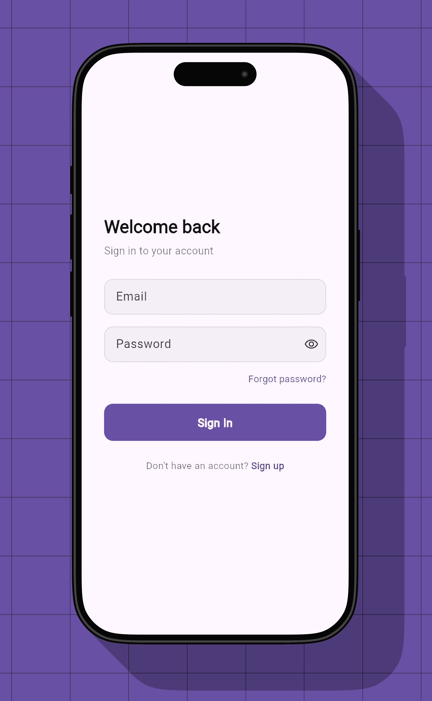
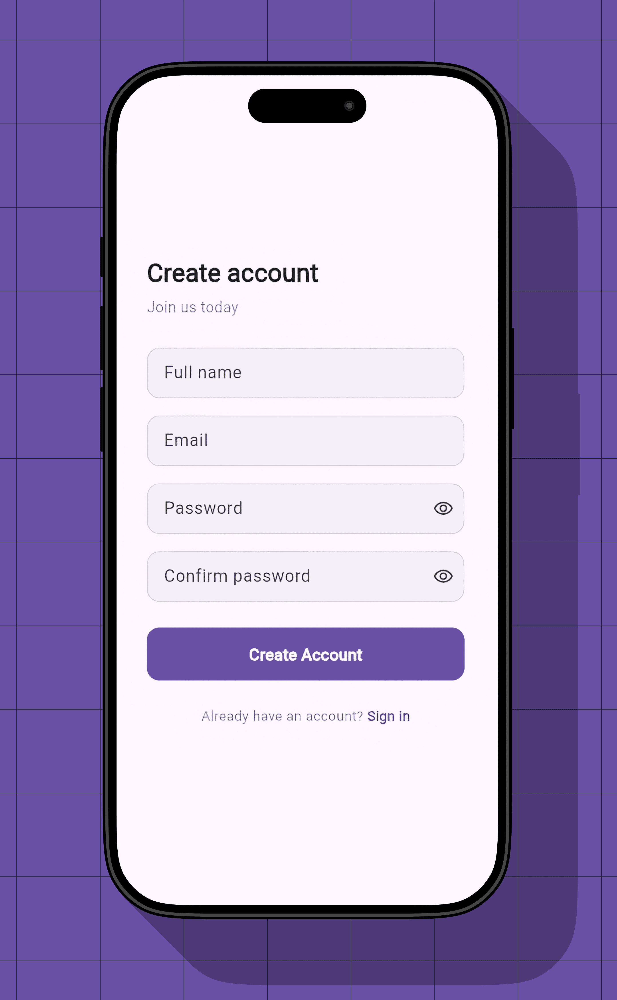
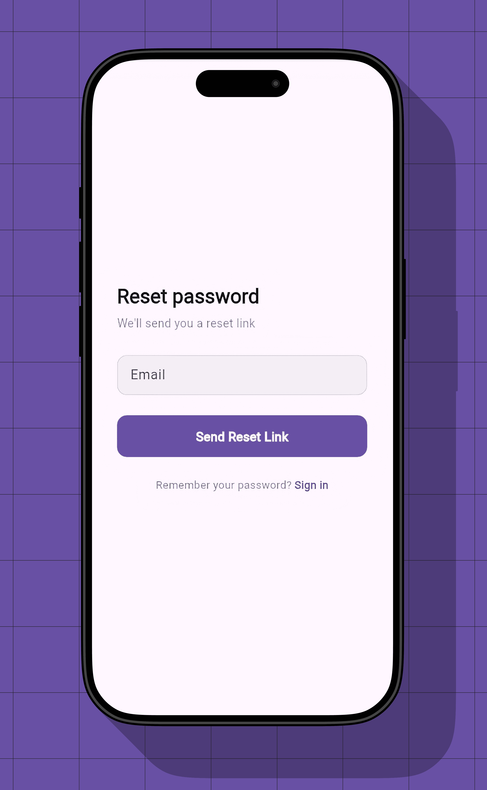
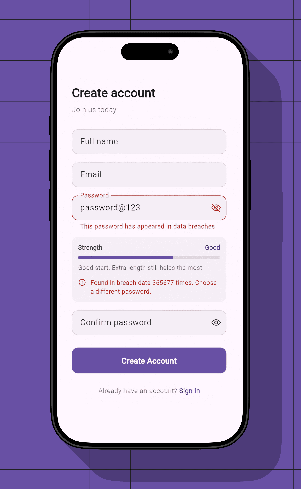
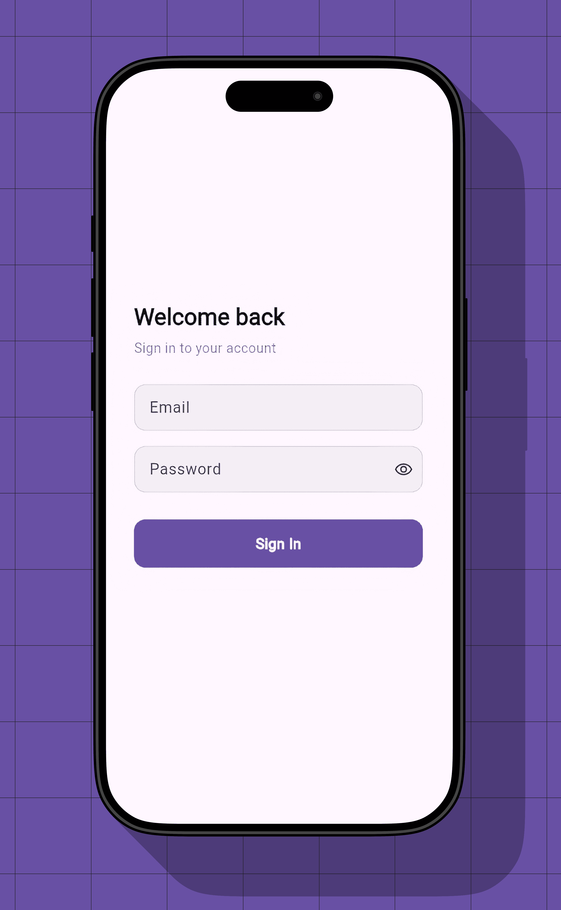
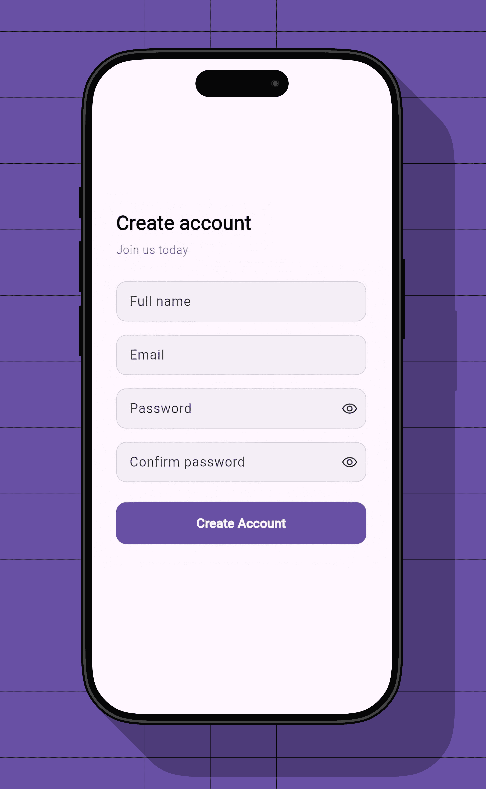
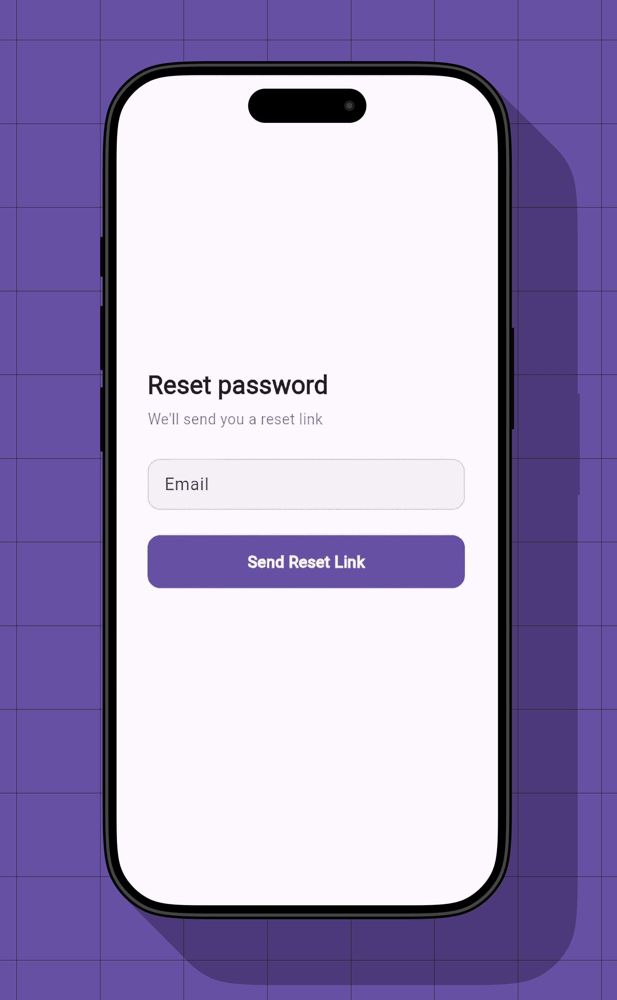

# flutter_auth_flow

The drop-in authentication widget for Flutter — **fully modular, pick what you need**.

Add the widget, and it just works. Use only Sign In, only Sign Up, only Forgot Password, or any combination.

---

## Features

- **Use only what you need** — Enable Sign In, Sign Up, or Forgot Password individually
- **Custom authentication** — Plug in your own API callbacks easily
- Works with any state management (BLoC, Riverpod, Provider)
- Built-in form validation & loading states
- Optional sign-up password strength meter and HIBP breach check
- Smooth animated transitions
- Fully customizable UI

---

## Screenshots

### All Modes

| Sign In | Sign Up |
|--------|---------|
|  |  |

| Forgot Password | Password Strength |
|----------------|-------------------|
|  |  |

### Single-Mode Presets

| Sign In Only | Sign Up Only | Forgot Password Only |
|-------------|--------------|----------------------|
|  |  |  |

---

## Quick Start

### Sign In Only

```dart
import 'package:flutter/material.dart';
import 'package:flutter_auth_flow/flutter_auth_flow.dart';

AuthFlow(
  authFlowType: AuthFlowType.signInOnly(),
  onSignIn: (email, password) async {
    await FirebaseAuth.instance.signInWithEmailAndPassword(
      email: email,
      password: password,
    );
  },
  onSignInSuccess: () => Navigator.pushReplacementNamed(context, '/home'),
)
```

### Sign In + Sign Up (No Forgot Password)

```dart
AuthFlow(
  authFlowType: AuthFlowType.signInAndSignUp(),
  onSignIn: (email, password) async { ... },
  onSignUp: (email, password, name) async { ... },
  onSignInSuccess: () => goHome(),
  onSignUpSuccess: () => goHome(),
)
```

### All Modes (Default)

```dart
AuthFlow(
  // authFlowType defaults to AuthFlowType.all
  onSignIn: (email, password) async { ... },
  onSignUp: (email, password, name) async { ... },
  onForgotPassword: (email) async { ... },
  onSignInSuccess: () => goHome(),
  onSignUpSuccess: () => goHome(),
  onForgotPasswordSuccess: () => showSuccessDialog(),
)
```

### With Custom Backend (Supabase, Custom API, etc.)

```dart
AuthFlow(
  authFlowType: AuthFlowType.signInAndSignUp(),
  onSignIn: (email, password) async {
    final response = await supabase.auth.signInWithPassword(
      email: email,
      password: password,
    );
    if (response.user == null) {
      throw Exception('Invalid credentials');
    }
  },
  onSignUp: (email, password, name) async {
    await supabase.auth.signUp(
      email: email,
      password: password,
      data: {'name': name},
    );
  },
  onSignInSuccess: () => goHome(),
  onSignUpSuccess: () => goHome(),
)
```

### With Password Strength + Breach Check

```dart
AuthFlow(
  authFlowType: AuthFlowType.signInAndSignUp(),
  onSignIn: (email, password) async { ... },
  onSignUp: (email, password, name) async { ... },
  passwordPolicy: const PasswordPolicy(
    showStrengthIndicator: true,
    minLength: 10,
    enablePwnedCheck: true,
    blockPwnedPasswords: true,
  ),
)
```

---

## AuthFlowType Presets

| Preset | Description |
|--------|-------------|
| `AuthFlowType.all()` | All three modes (default) |
| `AuthFlowType.signInOnly()` | Sign In only |
| `AuthFlowType.signUpOnly()` | Sign Up only |
| `AuthFlowType.forgotPasswordOnly()` | Forgot Password only |
| `AuthFlowType.signInAndSignUp()` | Sign In + Sign Up |
| `AuthFlowType.signInAndForgotPassword()` | Sign In + Forgot Password |
| `AuthFlowType.signUpAndForgotPassword()` | Sign Up + Forgot Password |

### Custom Configuration

```dart
// Custom set of modes
AuthFlow(
  authFlowType: AuthFlowType(enabledModes: {AuthMode.signIn, AuthMode.forgotPassword}),
  onSignIn: (email, password) async { ... },
  onForgotPassword: (email) async { ... },
  onSignInSuccess: () => goHome(),
  onForgotPasswordSuccess: () => showDialog(),
)
```

---

## API Reference

### AuthFlow

| Parameter | Type | Default | Description |
|-----------|------|---------|-------------|
| `authFlowType` | `AuthFlowType` | `AuthFlowType.all` | Which modes to enable |
| `onSignIn` | `Future<void> Function(String, String)?` | — | Sign-in callback (required if signIn enabled) |
| `onSignUp` | `Future<void> Function(String, String, String)?` | — | Sign-up callback (required if signUp enabled) |
| `onForgotPassword` | `Future<void> Function(String)?` | — | Password reset callback (required if forgotPassword enabled) |
| `onSignInSuccess` | `void Function()?` | — | Called after successful sign-in |
| `onSignUpSuccess` | `void Function()?` | — | Called after successful sign-up |
| `onForgotPasswordSuccess` | `void Function()?` | — | Called after successful password reset |
| `isLoading` | `bool?` | — | External loading state override |
| `errorMessage` | `String?` | — | External error message override |
| `initialMode` | `AuthMode?` | First enabled mode | Starting mode |
| `theme` | `AuthFlowTheme?` | — | Visual customization |
| `passwordPolicy` | `PasswordPolicy?` | — | Optional sign-up password meter and breach policy |
| `headerBuilder` | `Widget Function(BuildContext, AuthMode)?` | — | Custom header |
| `footerBuilder` | `Widget Function(BuildContext, AuthMode)?` | — | Custom footer |
| `errorBuilder` | `Widget Function(BuildContext, String)?` | — | Custom error display |
| `loadingBuilder` | `Widget Function(BuildContext)?` | — | Custom loading indicator |
| `submitButtonBuilder` | `Widget Function(BuildContext, VoidCallback, bool)?` | — | Custom submit button |
| `modeSwitcherBuilder` | `Widget Function(BuildContext, AuthMode, void Function(AuthMode))?` | — | Custom mode switcher |

### AuthFlowType

```dart
// Presets
AuthFlowType.all()
AuthFlowType.signInOnly()
AuthFlowType.signUpOnly()
AuthFlowType.forgotPasswordOnly()
AuthFlowType.signInAndSignUp()
AuthFlowType.signInAndForgotPassword()
AuthFlowType.signUpAndForgotPassword()

// Custom
AuthFlowType(enabledModes: {AuthMode.signIn, AuthMode.signUp})
```

### AuthMode

```dart
enum AuthMode {
  signIn,
  signUp,
  forgotPassword,
}
```

### PasswordPolicy

```dart
const PasswordPolicy(
  showStrengthIndicator: true,
  minLength: 8,
  enablePwnedCheck: false,
  blockPwnedPasswords: true,
)
```

`enablePwnedCheck` uses the free Have I Been Pwned Pwned Passwords range API. If the lookup fails, sign-up is still allowed and the widget shows a warning instead of blocking the user.

### AuthFlowTheme

```dart
AuthFlowTheme(
  // Theme Mode
  themeMode: ThemeMode.system, // auto-detect from system (default), light, or dark

  // Colors
  primaryColor: Colors.blue,
  backgroundColor: Colors.white,
  inputFillColor: Colors.grey[100],
  errorColor: Colors.red,

  // Typography
  titleStyle: TextStyle(fontSize: 24, fontWeight: FontWeight.bold),
  subtitleStyle: TextStyle(fontSize: 14, color: Colors.grey),
  inputStyle: TextStyle(fontSize: 16),
  buttonTextStyle: TextStyle(fontSize: 16, fontWeight: FontWeight.w600),
  linkStyle: TextStyle(fontSize: 14),

  // Shape
  inputBorderRadius: BorderRadius.circular(12),
  buttonBorderRadius: BorderRadius.circular(12),

  // Full overrides
  cardDecoration: BoxDecoration(...),
  buttonStyle: ButtonStyle(...),
  inputDecoration: InputDecoration(...),

  // Animation
  transitionDuration: Duration(milliseconds: 300),
  transitionCurve: Curves.easeInOut,
)
```

#### Theme Mode

The `themeMode` property controls whether the widget uses light, dark, or system theme:

| Value | Description |
|-------|-------------|
| `ThemeMode.system` (default) | Automatically uses the device's system brightness |
| `ThemeMode.light` | Forces light mode |
| `ThemeMode.dark` | Forces dark mode |

```dart
// Auto-detect from system (default)
AuthFlow(
  theme: AuthFlowTheme(themeMode: ThemeMode.system),
)

// Force dark mode
AuthFlow(
  theme: AuthFlowTheme(themeMode: ThemeMode.dark),
)
```

---

## Installation

```yaml
dependencies:
  flutter_auth_flow: ^0.0.6
```

---

## License

MIT
